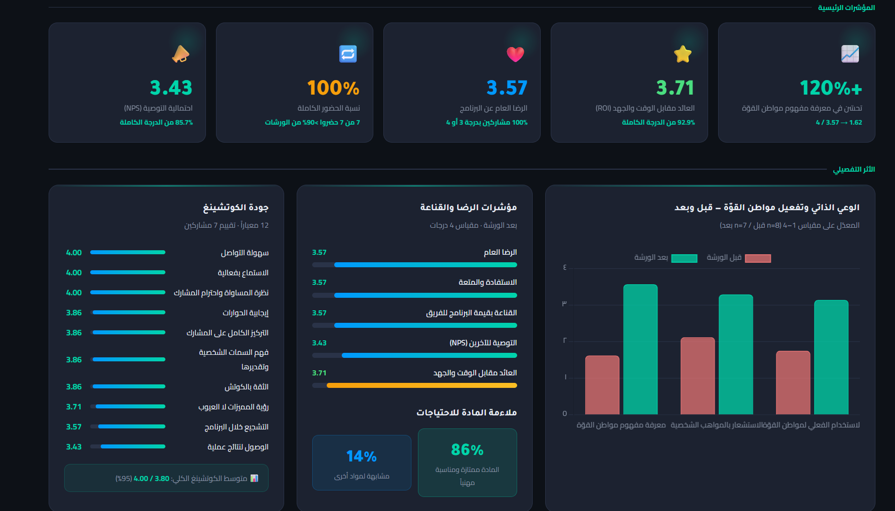
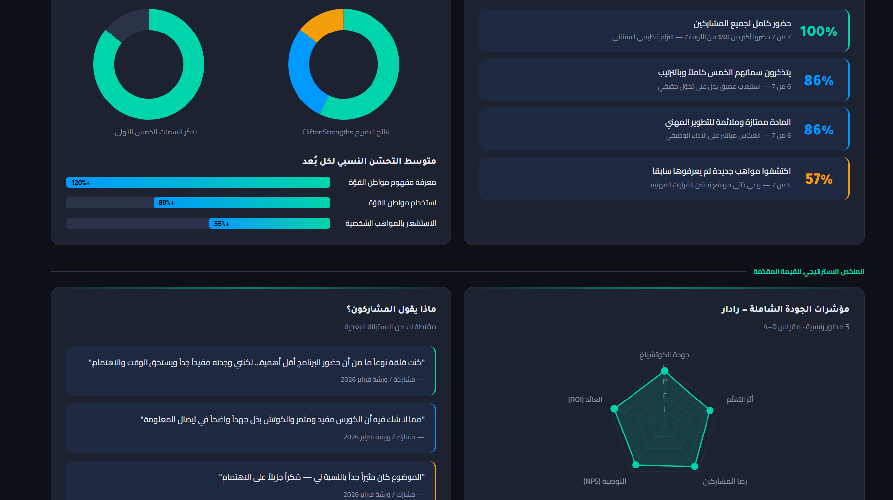

# 📊 تقرير أثر برنامج مواطن القوّة 

## 📝 نبذة عن المشروع 
هذا المشروع عبارة عن لوحة تحكم تفاعلية (Interactive Dashboard) تم تطويرها لتحليل نتائج "برنامج مواطن القوة" المقدم لمنظمة KHCPA. يهدف التقرير إلى قياس الأثر الذي تقدمه شركة توازن للبرنامج من خلال مقارنة البيانات القبلية والبعدية للمشاركين، وتحليل مستوى الرضا والجودة

---

## 🚀 المؤشرات الرئيسية 
* **تحسن ملحوظ:** زيادة بنسبة **120%** في استيعاب مفهوم مواطن القوة.
* **عائد مرتفع:** حقق البرنامج **3.71/4** في مؤشر العائد مقابل الاستثمار (ROI) من وجهة نظر المشاركين.
* **التزام تام:** نسبة حضور كاملة **100%** لجميع الورشات.
* **جودة الكوتشينغ:** تقييم أداء الكوتش بلغ **95%** بناءً على 12 معياراً دقيقاً.

---

## 🛠 التقنيات المستخدمة 
* **Frontend:** HTML5, CSS3 (Custom Dashboard UI).
* **Data Visualization:** [Chart.js](https://www.chartjs.org/) (Radar, Bar, Doughnut charts).
* **Data Analysis:** Microsoft Excel (Cleaning & Processing raw survey data).
* **Deployment:** GitHub Pages.

---

## 📸 لقطات من التقرير 

---

## 📈 منهجية العمل 
1. **جمع البيانات:** تم استخراج البيانات الخام من استبانات (Google Forms) قبل وبعد البرنامج.
2. **تنظيف البيانات:** معالجة البيانات باستخدام Excel لاستخراج المتوسطات الحسابية ونسب النمو.
3. **التصميم والتطوير:** بناء واجهة مستخدم تعتمد على "Dark Mode" لضمان تجربة بصرية عصرية واحترافية.
4. **التمثيل البياني:** استخدام رسوم بيانية تفاعلية لتسهيل اتخاذ القرار من قبل الإدارة.

---
## 📂 المرفقات 
* [تحميل ملف تحليل البيانات - Excel](impact_report_mawaten_alquwwa.xlsx)
* لتحميل الداشبورد ملف html ثم ثلاث نقاط ثم تحميل 

## 👤 إعداد 
**[بتول الحافي]**
